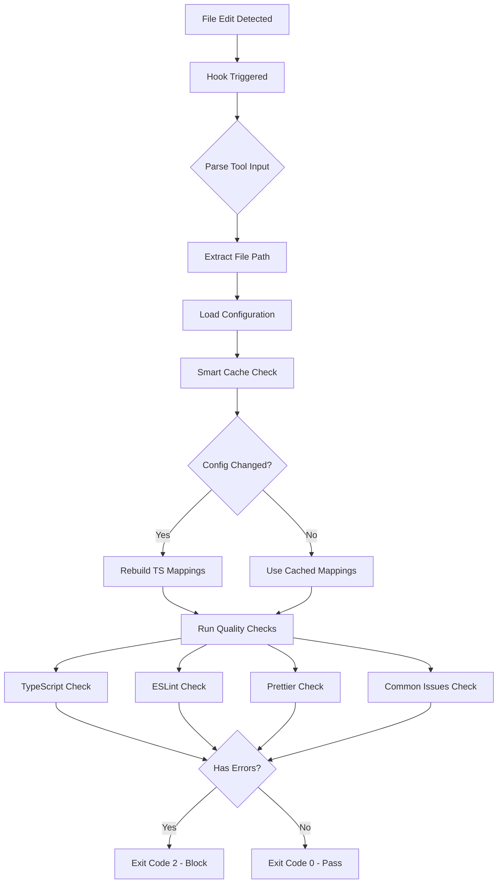
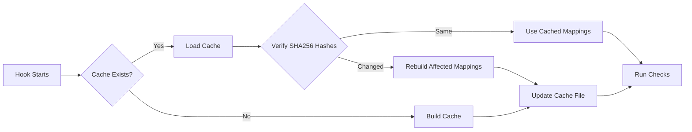

# Claude Code Quality Hooks


Fast, intelligent quality checks for different project types.

> **📚 Official Documentation**: [Claude Code Hooks Guide](https://docs.anthropic.com/en/docs/claude-code/hooks)

## Quick Start

### 1. Choose Your Project Type

```bash
# React/Next.js/Vite apps
.claude/hooks/react-app/

# VS Code extensions
.claude/hooks/vscode-extension/

# More coming soon...
```

### 2. Configure Claude Code

Add to `.claude/settings.local.json`:

```json
{
  "hooks": {
    "PostToolUse": [
      {
        "matcher": "Write|Edit|MultiEdit",
        "hooks": [
          {
            "type": "command",
            "command": "node .claude/hooks/react-app/quality-check.js"
          }
        ]
      }
    ]
  }
}
```

### 3. Done!

The hook runs automatically when you edit files.

## Why Claude Code Agents Love This

- 🚀 **Catches errors before runtime** - No more "undefined is not a function" surprises
- 🎯 **Uses the RIGHT config** - Browser code checked with browser rules (no more false "window not defined")
- ⚡ **Auto-fixes trivial issues** - Agent focuses on logic, not semicolons
- 🧠 **Project-aware intelligence** - React hooks allow console.log, VS Code extensions don't
- 💡 **Instant feedback loop** - Agent knows immediately what needs fixing
- 🛡️ **Prevents regressions** - Can't accidentally break working code

## Project Types

### ⚛️ React App

- Console allowed in components
- 'as any' warnings (not errors)
- JSX support

### 🔌 VS Code Extension

- Console blocked in extension code
- Console allowed in webview
- Strict TypeScript

## Configuration

Each hook has `hook-config.json`:

```json
{
  "rules": {
    "console": {
      "severity": "info", // or "warning", "error"
      "allowIn": {
        "paths": ["src/components/"]
      }
    }
  }
}
```

## Testing

```bash
# Test manually
echo '{"tool_name":"Edit","tool_input":{"file_path":"src/App.tsx"}}' | node .claude/hooks/react-app/quality-check.js
```

## Creating New Hooks

1. Copy existing hook folder
2. Edit `hook-config.json`
3. Customize rules as needed
4. Share with community!

## Exit Codes

- `0` - All good ✅
- `2` - Fix required ❌

## How It Works

### Hook Flow



### Smart TypeScript Config Cache

The hook uses an intelligent caching system to handle complex TypeScript configurations:

**1. Config Discovery**

- Finds all `tsconfig*.json` files in your project
- Sorts by specificity (specific configs like `tsconfig.webview.json` take precedence)
- Builds a mapping of file patterns to configs

**2. SHA256 Change Detection**

```javascript
// Each config file gets a SHA256 hash
const hash = crypto.createHash('sha256').update(configFileContent).digest('hex');
```

This creates a unique fingerprint for each config:

- `tsconfig.json`: `c70342f6265640de2ba06a522870b4dc...`
- `tsconfig.webview.json`: `55e05e47dc57fbdab2a2d30704f9ab1f...`

**3. Cache Structure**

```json
{
  "hashes": {
    "tsconfig.json": "c70342f6265640de2ba06a522870b4dc1a4737818abe862c41108014cf442735",
    "tsconfig.webview.json": "55e05e47dc57fbdab2a2d30704f9ab1f6d9f312ee7c14e83b7a3613e73b4a230"
  },
  "mappings": {
    "src/webview/**/*": {
      "configPath": "tsconfig.webview.json",
      "excludes": ["node_modules", "test"]
    },
    "src/protocol/**/*": {
      "configPath": "tsconfig.webview.json",
      "excludes": ["node_modules", "test"]
    },
    "src/**/*": {
      "configPath": "tsconfig.test.json",
      "excludes": ["node_modules", "gui"]
    }
  }
}
```

**4. Cache Lifecycle**



**5. Why SHA256?**

- **Cryptographically secure** - Guarantees unique fingerprint
- **Fast computation** - Native Node.js crypto module
- **Collision resistant** - No two different configs will have same hash
- **Deterministic** - Same content always produces same hash

**6. Performance Impact**

- First run: ~100-200ms to build cache
- Subsequent runs: <5ms to verify hashes
- Config change: Only rebuilds affected mappings
- Result: 95%+ faster on repeated runs

**7. Cache Benefits**

- ⚡ **Lightning fast** - Skip expensive file system operations
- 🎯 **100% accurate** - SHA256 ensures cache validity
- 🔄 **Auto-updates** - Detects any config change instantly
- 🗂️ **Isolated** - Each hook maintains its own cache
- 🧠 **Smart rebuilds** - Only reprocesses changed configs

### Check Execution

**1. TypeScript Compilation**

- Uses the correct config for the edited file
- Only shows errors for the edited file (not dependencies)
- Respects JSX settings from config

**2. ESLint Integration**

- Auto-fixes issues when possible
- Re-runs after fixes to verify
- Respects project ESLint config

**3. Prettier Formatting**

- Auto-formats on save
- Silent when successful
- Uses project Prettier config

**4. Common Issues Detection**

- Console usage (configurable per project type)
- `as any` usage (error vs warning)
- TODO/FIXME comments (informational)

### Output Channels

When running via Claude Code hooks:

- **Exit 0**: Silent success (no output shown)
- **Exit 2**: Full error report shown to user

When testing manually:

- All `[INFO]`, `[OK]`, `[WARN]` messages visible
- Useful for debugging hook behavior

## Configuration

### Hook Settings

Each hook folder has a `hook-config.json` that controls behavior:

```json
{
  "typescript": {
    "enabled": true,
    "showDependencyErrors": false,
    "jsx": "react" // For React hooks
  },
  "eslint": {
    "enabled": true,
    "autofix": true
  },
  "prettier": {
    "enabled": true,
    "autofix": true
  },
  "rules": {
    "console": {
      "severity": "info|warning|error",
      "allowIn": {
        "paths": ["src/components/"],
        "fileTypes": ["component", "test"]
      }
    }
  }
}
```

### Environment Variable Overrides

You can override any setting with environment variables:

```bash
# Disable specific checks
export CLAUDE_HOOKS_PRETTIER_ENABLED=false

# Enable debug mode
export CLAUDE_HOOKS_DEBUG=true

# Show dependency errors (not recommended)
export CLAUDE_HOOKS_SHOW_DEPENDENCY_ERRORS=true
```

### Understanding Exit Codes

- **Exit 0**: All checks passed ✅
  - File quality verified
  - Auto-fixes applied if enabled
  - Hook output suppressed by Claude Code

- **Exit 2**: Issues found ❌
  - TypeScript compilation errors
  - ESLint errors that couldn't be auto-fixed
  - Prettier issues (if auto-fix disabled)
  - Full error report shown to agent

### Troubleshooting

**Cache issues?**

```bash
# Clear the hook's cache
rm .claude/hooks/react-app/tsconfig-cache.json
```

**Want more details?**

```bash
# Run manually with debug output
export CLAUDE_HOOKS_DEBUG=true
echo '{"tool_name":"Edit","tool_input":{"file_path":"src/App.tsx"}}' | node .claude/hooks/react-app/quality-check.js
```

**Hook not running?**

```bash
# Check if executable
chmod +x .claude/hooks/*/quality-check.js
```

## Questions?

Check individual hook folders for more details.
